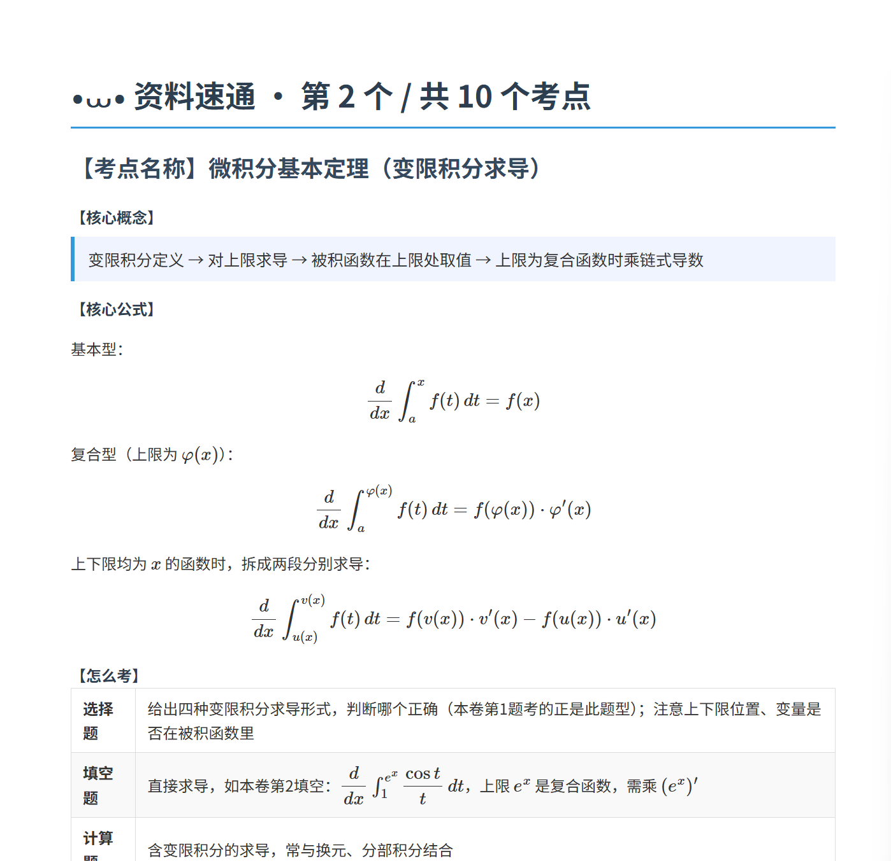
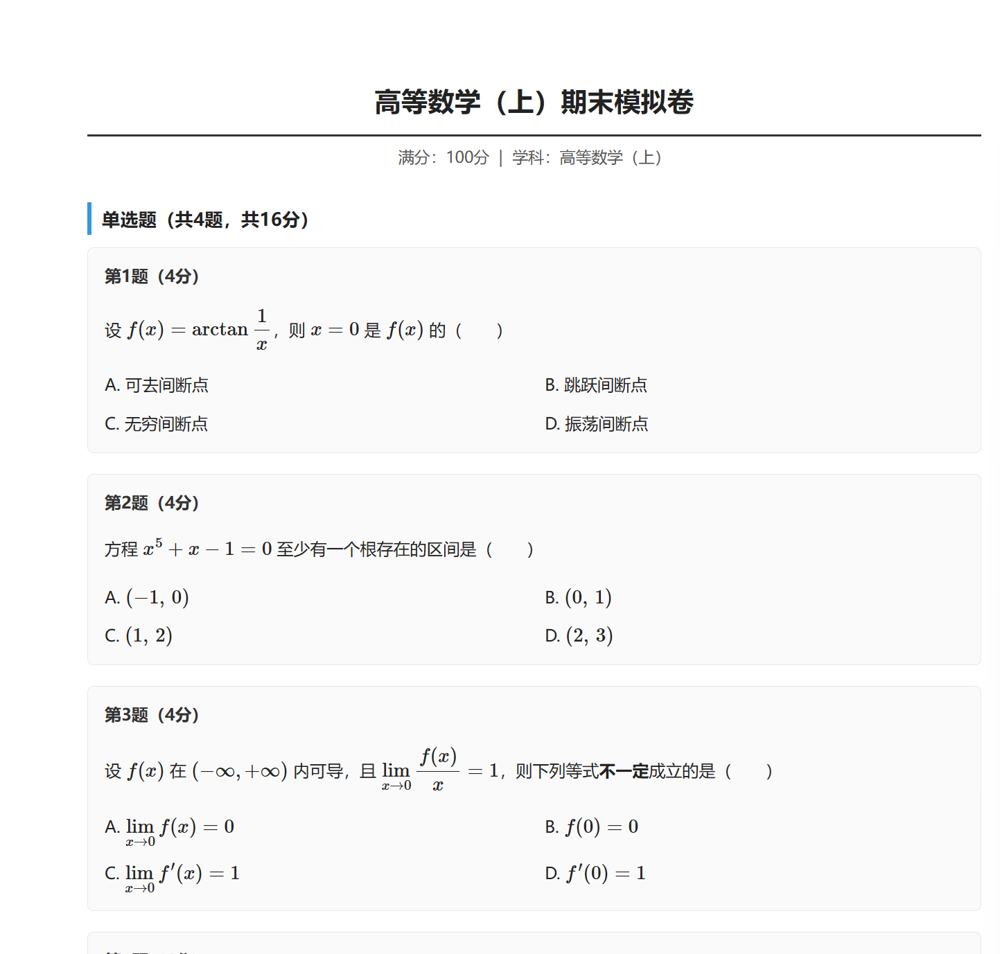
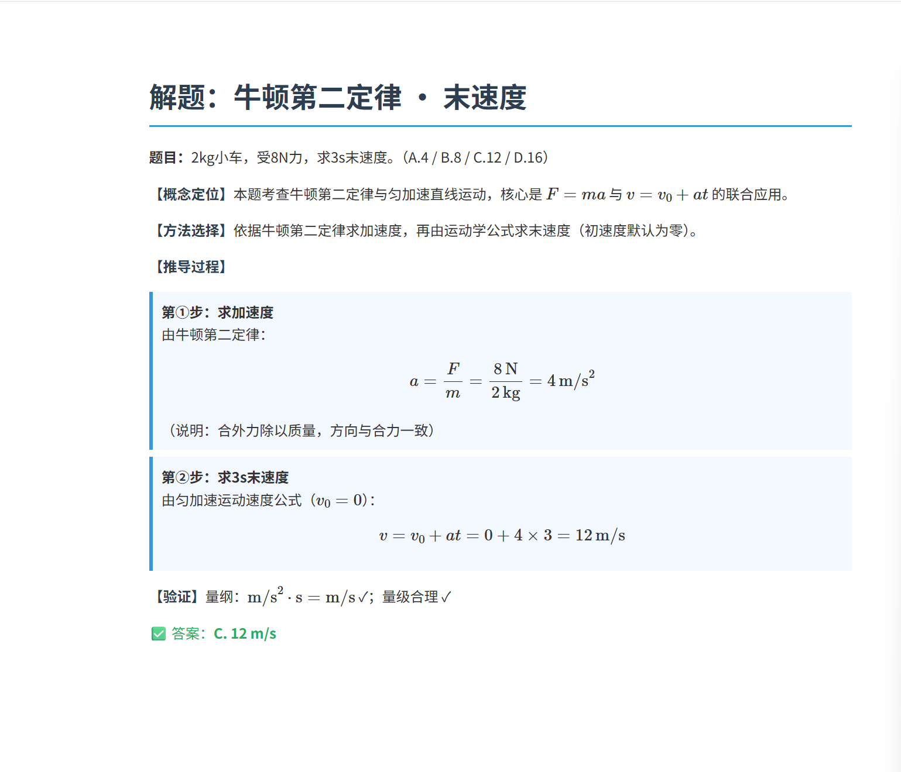

# ExamLoop

˶╹ꇴ╹˶ 期末前一周，AI帮我把整本书理清楚了

⦁֊⦁ᐝ 不是背题，是真的懂了

---

ʕ•͈⚇•͈ა **这是什么**

跑在 Claude Code 上的期末冲刺工具
从看资料到做题到出卷，一条线跑完

---

૮⑉･-･⑉ა **四个功能**

- 资料速通 — 上传PPT/PDF，自动提取考点和答题模板
- 出题练习 — 指定考点，按难度出题，自动批改
- 解题讲解 — 粘贴题目，分学科框架讲解
- 模拟出卷 — 生成完整试卷HTML文件

---

ᐞ･֊･ᐞฅ **安装**

```bash
# 方式一：npx 一行安装（推荐）
npx skills add munyoung-ovo/ExamLoop

# 方式二：git clone 安装（支持 git pull 自动更新）
git clone https://github.com/munyoung-ovo/ExamLoop.git
cd ExamLoop
bash install.sh    # 不推荐，优先用方式一

# 方式三：下载 ZIP 手动安装
# 点击右上角绿色按钮 Download ZIP，解压后进入文件夹
bash install.sh    # 不推荐，优先用方式一
```

**Windows 用户**

`.sh` 文件在 Windows 无法直接双击运行，建议直接用 npx 方式一。

如果必须手动安装：
1. 打开 `C:\Users\你的用户名\.claude\skills\`（没有就新建）
2. 把 `SKILL.md` 复制进去，改名为 `examloop.md`

---

ʚ˃ ᵕ ˂ɞ **载入 ExamLoop**

```bash
# 方式一：先载入再使用
skill examloop

# 方式二：直接调用
/examloop 速通

# 载入后直接说触发词
速通   出题   解题   出卷
```

---

˶ᵔ ᵕ ᵔ˶ **更新**

```bash
# git clone 安装的用户
git pull

# ZIP 安装的用户
bash update.sh
```

更新后开新对话即可生效。

---




